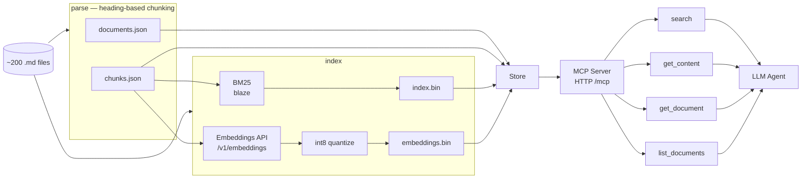

# Hybrid Agentic RAG — Chronicles of Aethelgard

A hybrid retrieval-augmented generation pipeline combining BM25 keyword search with int8-quantized semantic vector search, served as an MCP tool server for AI agent integration. Built around a 200-document AI-generated fantasy corpus designed for RAG evaluation.

## Architecture



| Layer | What it does |
|-------|-------------|
| **Parse** | Walks markdown files, chunks on H1/H2/H3 heading boundaries, outputs `documents.json` + `chunks.json` |
| **Index** | BM25 via [blaze](https://github.com/wizenheimer/blaze) → `index.bin`. Semantic vectors via any OpenAI-compatible API, int8 quantized → `embeddings.bin` |
| **Serve** | Loads all artifacts into a unified `Store`, registers 4 MCP tools, serves over HTTP at `/mcp` |

## Quick start

### 1. Start an embedding server

Any OpenAI-compatible `/v1/embeddings` endpoint works. The pre-built `./data` indexes were built with:

```
jina-embeddings-v5-small-retrieval (1024 dimensions, int8 quantized)
```

Run your server on `localhost:8080` — for example with llama.cpp:

```bash
llama-server \
  -m ~/models/jina-embeddings-v5-small-retrieval-Q4_K_M.gguf \
  --embedding --pooling last \
  -c 2048 -b 2048 -ub 2048 \
  --no-cache-prompt --parallel 1
```

### 2. Build the index

```bash
# Keyword-only (fast, no embedding server needed)
go run ./cmd/coe parse -i ./chronicles-of-aethelgard -o ./data

# Full hybrid keyword + semantic (requires embedding server on :8080)
go run ./cmd/coe parse -i ./chronicles-of-aethelgard -o ./data -e
```

### 3. Serve the MCP tool server

```bash
go run ./cmd/coe serve -d ./data
```

Server listens at `http://localhost:3001/mcp`. Use `-p` to change the port.

## MCP tools

| Tool | Description |
|------|-------------|
| `search(query, k?, mode?)` | Hybrid RFF (default), keyword (`text`), or semantic search |
| `get_content(index)` | Retrieve a chunk's full markdown by its content index |
| `get_document(source)` | Retrieve a complete document by its source path |
| `list_documents` | Browse all documents grouped by category with sizes |

### Connect with OpenCode

```json
{
  "mcp": {
    "chronicles-of-aethelgard": {
      "type": "remote",
      "url": "http://localhost:3001/mcp"
    }
  }
}
```

Restart your agent after connecting. It will discover the tools and receive usage instructions automatically.

## Choosing a search mode

| Mode | Best for | Example |
|------|----------|---------|
| `rff` (default) | General queries, balanced results | `"magical artifacts"` |
| `text` | Exact entity or term lookup | `"Throndor the Wise"` |
| `semantic` | Conceptual or descriptive queries | `"ancient volcanic landmarks"` |

## Design choices

- **Heading-based chunking** — documents split on H1/H2/H3 boundaries. The heading hierarchy becomes the breadcrumb in search results, giving the LLM structural context without dumping full documents.
- **Int8 quantization** — 1024-dimensional float32 embeddings compressed to int8. Pre-built indexes are ~2.4MB for 2,303 chunks (vs ~9.2MB uncompressed). Rank ordering between related and unrelated queries is fully preserved with under 1% relative cosine similarity loss:

  | Query pair | float32 | int8 | Rel. error |
  |------------|---------|------|------------|
  | "Elven Magic" ↔ "Elven Weavings" (related) | 0.5376 | 0.5403 | 0.51% |
  | "Elven Magic" ↔ "Dwarven Mining" (unrelated) | 0.3667 | 0.3694 | 0.74% |

- **Reciprocal Rank Fusion** — text and semantic hits merged with equal weight (RFF k=60). Each index contributes independently, then results are fused by reciprocal rank.
- **Flat vector layout** — vectors stored as a contiguous `[]int8` array (`N × Dim`). Cache-friendly single-pass KNN via a min-heap.

## Corpus

The `chronicles-of-aethelgard/` directory contains ~200 AI-generated markdown documents covering races, characters, locations, events, factions, and lore. All content was generated following the guidelines in `AETHELGARD.md`, which specifies kebab-case filenames matching H1 headings and a consistent heading hierarchy for chunking. Each entry contains 3–5 natural cross-references to other entities, creating an interconnected knowledge base for RAG evaluation.

The original races content was taken from the tutorial **["RAG from Scratch with Go and Ollama"](https://k33g.hashnode.dev/rag-from-scratch-with-go-and-ollama)** by Philippe Charrière and expanded ~20x with characters, locations, events, factions, and lore. The pipeline evolved from that tutorial's RAG into a hybrid BM25 + semantic search MCP tool server.

## Build

```bash
go build -o coe ./cmd/coe/
```

Requires Go 1.26+.

## License

MIT
